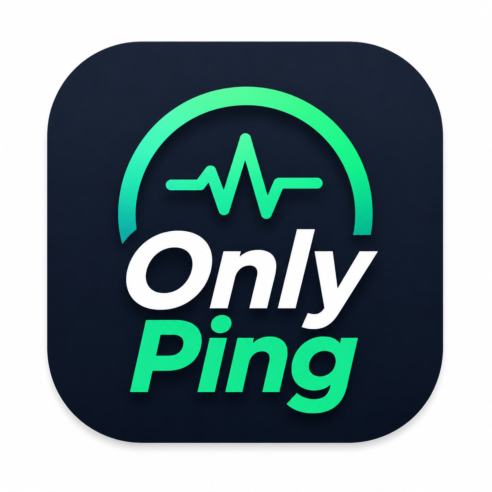
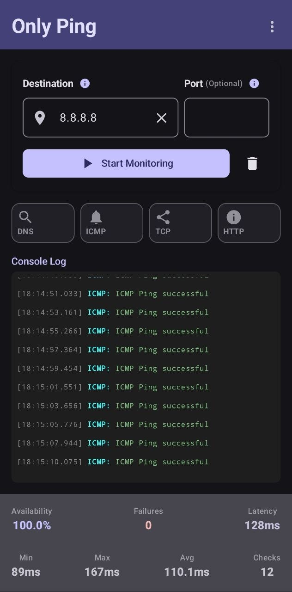

# Only Ping

<p align="center">
  
</p>

<p align="center">
  <b>A lightweight Android network reachability monitor.</b><br>
  Monitor websites, domains, IP addresses, and TCP services using a smart reachability-first strategy.
</p>

---

## Overview

Only Ping is an open-source Android application designed to answer one simple question:

> **Can my current internet connection actually reach this destination?**

Unlike traditional ping utilities that rely only on ICMP, Only Ping intelligently selects the best protocol depending on the destination type and provides detailed diagnostics using HTTP, TCP, ICMP, and DNS.

It is built for developers, network engineers, gamers, system administrators, and anyone who needs a quick way to verify connectivity directly from an Android device.

---

# Features

* 🌐 Monitor websites, hostnames, IP addresses and TCP services
* ⚡ Smart reachability-first monitoring
* 📡 DNS diagnostics
* 🔌 TCP connectivity testing
* 🌍 HTTP/HTTPS availability checks
* 📶 ICMP ping (when available)
* 📈 Real-time availability statistics
* ⏱ Live latency measurements
* 📋 Console-style event log
* 🎨 Modern Material 3 interface
* 🌙 Dark mode support
* 🚀 Lightweight and fast
* 🔓 Fully open source
* ❌ No ads
* 🔒 No tracking
* 📱 Designed specifically for Android

---

# Supported Inputs

Examples:

```text
google.com
```

```text
https://google.com
```

```text
8.8.8.8
```

```text
1.1.1.1
```

```text
1.1.1.1:443
```

```text
example.com:25565
```

The application automatically determines the appropriate monitoring strategy based on the destination.

---

# Reachability Strategy

Only Ping does **not** rely on a single protocol.

Instead, it chooses the most appropriate connectivity test depending on the destination.

### Website

Primary:

* HTTP HEAD request

Diagnostics:

* DNS
* TCP (if needed)

---

### Hostname

Primary:

* DNS
* HTTP

---

### IP + Port

Primary:

* TCP connection

Diagnostics:

* ICMP

---

### Raw IP

Primary:

* ICMP

Fallback:

* TCP 443
* TCP 80

---

The goal is to determine whether the destination is actually reachable rather than simply whether one protocol succeeds.

---

# Statistics

The application continuously calculates:

* Availability
* Failures
* Current Latency
* Average Latency
* Minimum Latency
* Maximum Latency
* Total Checks
* Running Time

---

# Built With

* Kotlin
* Jetpack Compose
* Material 3
* MVVM Architecture
* Kotlin Coroutines
* StateFlow
* Android SDK

---

# Privacy

Only Ping respects your privacy.

* No advertisements
* No analytics
* No tracking
* No user accounts
* No personal data collection

All connectivity checks are performed directly from your device.

---

# Screenshots

<p align="center">
  
</p>

---

# Roadmap

* Export monitoring logs
* Custom monitoring interval
* Multiple destination monitoring
* Notifications
* History
* Material You improvements
* Widgets
* IPv6 enhancements

---

# Contributing

Contributions are welcome.

If you have ideas, bug reports, or feature requests, please open an Issue or submit a Pull Request.

---

# ❤️ Support

If you find **Only Ping** useful and would like to support future development, you can donate using cryptocurrency.

### Bitcoin (BTC)

```text
bc1qskmtga2nfxcdzvhdedcm3l3q9h30czrplw603y
```

### Ethereum (ETH)

```text
0x9530BF0A5023Aa659CD4cf62E051e65F423058aE
```

### USDT (TRC20)

```text
TBm3hiDK3wYz4XcV4MEnCJjxZG9eYnHhLp
```

Every contribution helps maintain and improve the project. Thank you for your support!

---

# License

This project is licensed under the MIT License.

---

# Author

**Matin**

GitHub:
https://github.com/Matin-Ar

Repository:
https://github.com/Matin-Ar/OnlyPing

Made with ❤️ for the Android and open-source community.
